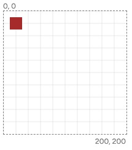

# viewBox 属性
感觉 viewBox 是 svg 的灵魂，非常重要！

## 简介

1. viewBox 属性的值是一个包含 4 个参数的列表 min-x, min-y, width , height，以空格或者逗号分隔开

| 参数     | 说明                                | 举例 |
| -------- | ----------------------------------- | ---- |
| `min-x`  | **左上角的 x 坐标**（逻辑坐标起点） | 0    |
| `min-y`  | **左上角的 y 坐标**                 | 0    |
| `width`  | **viewBox 的宽度**（逻辑宽度范围）  | 100  |
| `height` | **viewBox 的高度**（逻辑高度范围）  | 100  |

2. 这个属性会受到 preserveAspectRatio 的影响
3. 有`<marker>, <pattern>, <svg>, <symbol>, 和 <view>` 等五个 svg 元素可以有这个属性

```html
<svg viewBox="0 0 100 100"></svg>
```

## 写一个循序渐进的示例

### 绘制一个简单矩形

```html
<svg width="200" height="200" style={{ border: "1px solid #333" }}>
    <rect x="10" y="10" width="20" height="20" fill="brown" />
 </svg>
```



### svg 标签上添加 viewBox 属性

我们可以根据 viewBox 属性来移动坐标系统的原点,前两个参数对应左上角的坐标，即设置坐标原点

```html
<svg width="200" height="200" viewBox="-100 -100 200 200" style={{ border: "1px solid #333" }}>
    <rect x="10" y="10" width="20" height="20" fill="brown" />
</svg>
```


### viewBox 属性的可视区域，使图形缩放

后面两个参数对应宽高，如果我们定义的宽高和 svg 的宽高一致,那么矩形不会发生变化
但是如果 viewBox 定义的 width 和 height 不同，矩形会缩小或放大。

如下图，矩形的宽高分别放大了两倍，那是因为 svg 图的宽高没有变化，但是会认为现在的可视区域是
100x100。 可以认为会自动把 100x100 的坐标系缩放填充到 svg 200x200 的实际宽高上。所以是宽高各放大两倍。

```html
<svg width="200" height="200" viewBox="-100 -100 100 100" style={{ border: "1px solid #333" }}>
    <rect x="10" y="10" width="20" height="20" fill="brown" />
</svg>
```


## 小demo
查看地址： __/app/examples/ChristmasTree/index.jsx__
[[圣诞树]](../app/examples/ChristmasTree/index.jsx)

## 那么 viewBox 的作用呢

**缩放（Zooming）:** 属性允许 SVG 图形在不同尺寸的容器中进行缩放，而不会失真或扭曲。这使得 SVG 图形在各种屏幕尺寸和分辨率下都能保持清晰显示，具有良好的响应式设计能力。

**定位（Positioning）:** 通过设置 viewBox 的 min-x 和 min-y 属性，可以控制 SVG 图形在容器中的起始位置，从而实现图形在容器中的精确布局

**裁剪（Clipping）:** 当 viewBox 的尺寸小于 SVG 元素的实际尺寸时，viewBox 会裁剪超出部分，只显示 viewBox 定义的区域。这可以用于显示 SVG 图形的特定部分，或者创建一些有趣的视觉效果。

